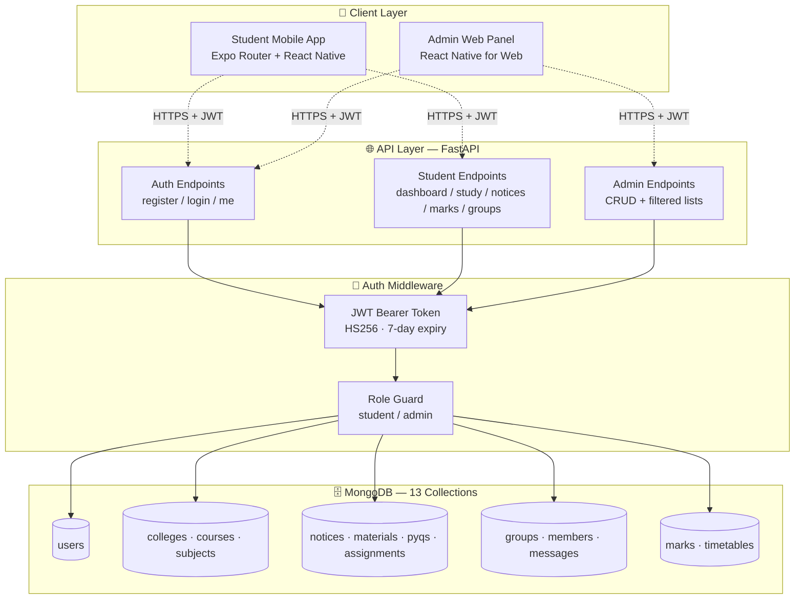
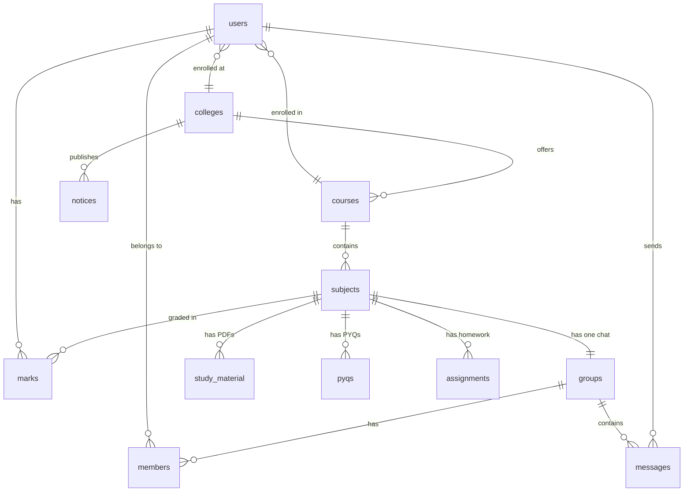

<div align="center">


# Our Space

**A college-level LMS + real-time academic communication platform**

_Built as a full-stack cross-platform application — one codebase powers the Android/iOS student app and the web admin panel._


</div>

---

## 📖 Table of Contents

1. [Overview](#-overview)
2. [Screenshots](#-screenshots)
3. [Tech Stack](#-tech-stack)
4. [System Architecture](#-system-architecture)
5. [Features](#-features)
6. [Project Structure](#-project-structure)
7. [Getting Started](#-getting-started)
8. [Demo Credentials](#-demo-credentials)
9. [API Reference](#-api-reference)
10. [Database Schema](#-database-schema)
11. [Data Scoping — how personalization works](#-data-scoping--how-personalization-works)
12. [How to Add Content as an Admin](#-how-to-add-content-as-an-admin)
13. [Publishing to Play Store / App Store](#-publishing-to-play-store--app-store)
14. [What's Not Built](#-whats-not-built-honest-limitations)
15. [Credits](#-credits)

---

## 🌌 Overview

**Our Space** is a production-ready mobile + web application designed for colleges. Students get a beautiful mobile app to access study material, previous year papers, assignments, notices, marks, and real-time subject-based chat groups. Administrators use a web dashboard to manage multiple colleges, courses, subjects, students, and all content.

### Original problem statement (v1.0)
Build a college-level Learning Management System (LMS) + ERP + real-time academic communication system with:
- Study materials, PYQs, assignments (PDFs)
- Notices system with categories
- Marks system with CGPA
- Real-time subject-based group chat
- Multi-role support (student, admin)
- Role-based routing (student → mobile app, admin → web panel)

---

## 📸 Screenshots

| Splash | Login | Home Dashboard |
|:---:|:---:|:---:|
| Instagram-style logo pop-up on black, 2s fade | Clean auth with gradient header and animated logo | Welcome hero + timetable + 2×2 quick actions + latest notices |

| Study Module | WhatsApp-style Chat | Marks + CGPA |
|:---:|:---:|:---:|
| Chip tabs for Material / PYQ / Assignments. Tap opens PDF. | Real-time 2.5s polling. Own bubbles right (brand), others left. | Gradient CGPA card + per-subject internal / external / total / grade |

| Admin Dashboard | Admin Content Manager | Admin Filters |
|:---:|:---:|:---:|
| 9 stat cards (students, colleges, courses, notices, PDFs, groups…) | CRUD table for notices/materials/PYQs/assignments with modal forms | Cascading filter pills: College → Course → Semester |

_Add real screenshots under `docs/screenshots/` and update the table with `` before submitting._

---

## 🧰 Tech Stack

| Layer | Technology | Why |
|-------|-----------|-----|
| **Mobile client** | React Native (Expo SDK 54) + TypeScript | Cross-platform (iOS + Android + web) from one codebase |
| **Navigation** | expo-router (file-based routing) | Deep linking, typed routes |
| **Animations** | react-native-reanimated | 60fps native animations for splash |
| **State + Data** | React Context + Axios + expo-secure-store | Zero external state library needed |
| **Backend** | FastAPI (Python 3.11) | Async, auto-generated OpenAPI docs |
| **Database** | MongoDB (Motor async driver) | NoSQL document store, flexible schema |
| **Authentication** | Custom JWT (PyJWT) + bcrypt | Industry-standard, self-owned |
| **Real-time** | 2.5-second HTTP polling | Simple, reliable, no WebSocket infrastructure needed |
| **File storage** | External URLs (e.g., Google Drive) | PDFs live outside the DB; only links are stored |

### ⚠️ Why Not Firebase?
This project was originally spec'd for Firebase but was **intentionally built without Firebase**. Instead, we used **MongoDB + FastAPI + JWT** because:
1. **Full-stack engineering demonstration** — we wrote the API, auth, and schema by hand
2. **Vendor-independent** — no lock-in to a single cloud provider
3. **Functionally equivalent** — the app still has cloud data, secure login, and real-time chat
4. **Better for learning** — every layer is inspectable Python/TypeScript code, no black boxes

If you specifically need Firebase for a course requirement, the schema (13 collections) maps 1:1 to Firestore.

---

## 🏗 System Architecture



### Request flow (student opens Home tab)

```
User taps Home
   ↓
[Frontend] axios.get('/api/dashboard') + Authorization: Bearer <jwt>
   ↓
[FastAPI] decode JWT → get user_id → fetch user
   ↓
[Backend] aggregate 4 queries scoped by
          { college_id, course_id, semester }
          - notices (top 3)
          - assignments (top 3)
          - materials (top 3)
          - timetable
   ↓
[MongoDB] returns matching documents
   ↓
[Frontend] renders dashboard cards
```

---

## ✨ Features

### 👨‍🎓 Student App (mobile)

- **Auth**
  - Username + password login (no email required)
  - Registration with cascading dropdowns (college → filtered courses)
  - Change password
- **Home Dashboard**
  - Welcome hero with student name + roll number
  - Today's timetable
  - 2×2 quick actions grid (Marks, Study, PYQs, Assignments)
  - Latest 3 notices + upcoming 3 assignments + recent 3 materials
- **Study Module**
  - Sticky chip tabs: Material / PYQ / Assignments
  - PDF cards open via `expo-web-browser`
- **Notices**
  - Feed with horizontal category chip filter
  - 7 categories: Announcements, Exams, Events, Holidays, Circulars, Placements, Achievements
- **Marks**
  - CGPA card with subject-wise breakdown
  - Grade pills with colored severity
- **Groups + Chat**
  - Auto-joined into subject groups on registration
  - WhatsApp-style bubbles (own = right/brand color, others = left/white)
  - Real-time polling every 2.5 seconds
- **Profile**
  - Avatar banner + full user info
  - Logout + change password shortcuts

### 👨‍💼 Admin Web Panel

- **Dashboard** — 9 live stat cards
- **Colleges** — full CRUD (5 seeded)
- **Courses** — CRUD with college filter (14 seeded)
- **Notices** — CRUD with 7 categories + college filter
- **Study Material** — CRUD with **cascading filters** (college → course → semester)
- **PYQs** — CRUD with year field
- **Assignments** — CRUD with due date
- **Marks** — per-student subject-wise management with grade picker
- **Students** — read-only list of all registered accounts

### 🎨 Design System

- **Palette:** Indigo `#3F51B5`, Purple `#7E57C2`, Teal `#009688`, Background `#F5F6FA`
- **Material Design 3** styling with 16dp rounded cards, pill buttons
- **Shimmer skeleton loaders** (no ugly spinners)
- **Instagram-style splash** — logo scale + fade animation on cold start (2s)
- **Custom logo** used for app icon (Play Store / App Store), Android adaptive icon, favicon, and splash

---

## 📁 Project Structure

```
our-space/
├── backend/
│   ├── server.py               # 1,006 lines — all APIs + auth + seed
│   ├── requirements.txt        # Python dependencies
│   └── .env                    # MONGO_URL, DB_NAME, JWT_SECRET
│
├── frontend/
│   ├── app/                    # Screens (expo-router file-based)
│   │   ├── _layout.tsx         # Root layout, auth gate, splash
│   │   ├── index.tsx           # Entry redirect
│   │   ├── (auth)/             # Login + register
│   │   ├── (tabs)/             # 5 bottom tabs
│   │   ├── chat/[id].tsx       # WhatsApp-style chat
│   │   ├── admin/              # 9 admin panel screens
│   │   ├── marks.tsx
│   │   └── change-password.tsx
│   │
│   ├── src/                    # Non-route code
│   │   ├── api.ts              # Axios + JWT interceptor
│   │   ├── auth.tsx            # AuthContext
│   │   ├── theme.ts            # Design tokens
│   │   ├── shimmer.tsx         # Loading skeleton
│   │   ├── brand-splash.tsx    # Animated logo splash
│   │   ├── admin-crud.tsx      # Reusable admin CRUD component
│   │   └── content-admin.tsx   # Shared logic for materials/pyqs/assignments
│   │
│   ├── assets/images/
│   │   ├── icon.png            # 1024×1024 store icon
│   │   ├── adaptive-icon.png   # Android adaptive
│   │   ├── favicon.png
│   │   └── splash-image.png
│   │
│   ├── app.json                # Expo config (name: "Our Space")
│   ├── package.json
│   └── .env                    # EXPO_PUBLIC_BACKEND_URL
│
└── README.md                   # this file
```

---

## 🚀 Getting Started

### Prerequisites
- **Node.js 20+** and **Yarn**
- **Python 3.11+** and `pip`
- **MongoDB** running locally (or a MongoDB Atlas connection string)
- **Expo Go** app on your phone (for mobile testing)

### 1. Clone the repo
```bash
git clone <your-repo-url> our-space
cd our-space
```

### 2. Backend setup
```bash
cd backend
pip install -r requirements.txt

# create .env
cat > .env <<EOF
MONGO_URL=mongodb://localhost:27017
DB_NAME=ourspace_db
JWT_SECRET=change-this-in-production
EOF

# run server
uvicorn server:app --reload --host 0.0.0.0 --port 8001
```

The backend seeds demo data automatically on first startup. Visit `http://localhost:8001/docs` to see auto-generated Swagger API docs.

### 3. Frontend setup
```bash
cd frontend
yarn install

# create .env
echo "EXPO_PUBLIC_BACKEND_URL=http://localhost:8001" > .env

# start Expo
yarn expo start
```

- Scan the QR code with **Expo Go** on your phone to run the mobile app
- Or press `w` in the terminal to open the admin panel in a browser

---

## 🔑 Demo Credentials

Seeded automatically on first backend startup:

| Role | Username | Password | Landing screen |
|------|---------|----------|---------------|
| 🧑‍💼 Admin | `admin` | `admin1234` | Web admin panel at `/admin` |
| 🧑‍🎓 Student | `alex` | `alex1234` | Mobile app (BCA Sem 3, Delhi Uni) |
| 🧑‍🎓 Student | `neha` | `neha1234` | Mobile app (BCA Sem 3, Delhi Uni) — for chat testing |

**Delete these before production!** They're for demo/development only.

---

## 📡 API Reference

All endpoints are prefixed with `/api`. Auth endpoints return `{ access_token, user }` — send `Authorization: Bearer <token>` on every protected call.

### Public
| Method | Path | Description |
|--------|------|-------------|
| GET | `/` | Health check |
| GET | `/colleges` | List colleges (used by register form) |
| GET | `/courses?college_id=` | List courses (optionally filtered) |
| POST | `/auth/register` | Sign up (returns JWT) |
| POST | `/auth/login` | Log in (returns JWT + role) |

### Student (JWT required)
| Method | Path | Description |
|--------|------|-------------|
| GET | `/auth/me` | Current user profile |
| POST | `/auth/change-password` | Change password |
| GET | `/dashboard` | Home aggregation |
| GET | `/study/material` | Scoped study PDFs |
| GET | `/study/pyqs` | Scoped PYQs |
| GET | `/study/assignments` | Scoped assignments |
| GET | `/notices?category=` | Scoped notices with optional category |
| GET | `/marks` | Student's own marks + CGPA |
| GET | `/groups` | Student's chat groups |
| GET | `/groups/{id}/messages` | Get messages (with optional `since`) |
| POST | `/groups/{id}/messages` | Send a message |

### Admin (JWT + role=admin required)
| Method | Path | Description |
|--------|------|-------------|
| GET | `/admin/stats` | Dashboard counts |
| GET | `/admin/students` | All students |
| GET | `/admin/subjects` | All subjects (filter by course) |
| GET | `/admin/list/{colleges,courses,notices,materials,pyqs,assignments}` | Filtered lists |
| POST/PUT/DELETE | `/admin/colleges/{id}` | Manage colleges |
| POST/PUT/DELETE | `/admin/courses/{id}` | Manage courses |
| POST/DELETE | `/admin/subjects/{id}` | Add/delete subjects (auto-creates chat group) |
| POST/PUT/DELETE | `/admin/notices/{id}` | Manage notices |
| POST/PUT/DELETE | `/admin/materials/{id}` | Manage study material |
| POST/PUT/DELETE | `/admin/pyqs/{id}` | Manage PYQs |
| POST/PUT/DELETE | `/admin/assignments/{id}` | Manage assignments |
| GET/POST/PUT/DELETE | `/admin/marks/...` | Per-student marks |

**Interactive docs:** With the backend running, visit `http://localhost:8001/docs` — FastAPI auto-generates a Swagger UI where you can test every endpoint.

---

## 🗄️ Database Schema

Every collection uses a string UUID primary key (`id`). The MongoDB `_id` field is explicitly excluded from all API responses.



**13 collections in total:** `users`, `colleges`, `courses`, `subjects`, `groups`, `members`, `messages`, `notices`, `study_material`, `pyqs`, `assignments`, `marks`, `timetables`

Every content document (materials, PYQs, assignments, timetables) is tagged with `college_id`, `course_id`, `semester`, and `subject_id`. Every query filters by the logged-in student's scope — see the next section.

---

## 🎯 Data Scoping — how personalization works

Every student sees **only their own college + course + semester content**. Here's how:

1. On registration, the student's `college_id`, `course_id`, and `semester` are saved in the `users` collection
2. When the student logs in, these fields travel inside their JWT
3. Every content endpoint uses this helper:
   ```python
   def _scope_query(user):
       return {
           "college_id": user["college_id"],
           "course_id": user["course_id"],
           "semester": user["semester"]
       }
   ```
4. MongoDB returns only documents that match — **BBA students literally cannot see BCA data**, and vice-versa

**Live proof:** Register a BCA student and a BBA student, log in as each, and their entire app experience (materials, PYQs, timetable, chat groups) will be completely different — even though they use the exact same code and endpoints.

This pattern is called **row-level filtering** and is used by every serious SaaS product (Instagram, Slack, Notion, etc.).

---

## 📝 How to Add Content as an Admin

1. Open the app in a browser (the admin panel is also responsive on mobile)
2. Log in as `admin / admin1234`
3. You'll be routed to `/admin` — a sidebar navigation dashboard
4. Click any content type in the sidebar (e.g. **Study Material**)
5. Optionally use the **filter pills** at the top: College → Course → Semester
6. Click **"Add new"** — a modal appears
7. Fill the form; for PDFs, paste a public URL:
   - Upload PDF to your Google Drive
   - Right-click → Share → "Anyone with the link"
   - Copy the shareable URL
   - Paste it into the PDF URL field
8. Click **Save**
9. The new content appears **instantly** in the student app for all matching students

---

## 🚢 Publishing to Play Store / App Store

**In Emergent:**
1. Click **"Publish"** (top-right corner)
2. Choose your target: iOS IPA / Android APK / both
3. Provide your Apple Developer / Google Play credentials when prompted
4. Emergent builds and delivers the store-ready files

**The app will show up on the phone as:**
- **Name:** Our Space
- **Icon:** The cosmic planet logo (`assets/images/icon.png`)
- **Splash:** Same logo, animated on black background for 2 seconds on cold start

**Before publishing:**
- Delete demo accounts (`alex`, `neha`, `admin`) — see the seed block in `server.py` at the bottom
- Change the `JWT_SECRET` in `backend/.env` to a long random string
- Move MongoDB from local to MongoDB Atlas (free tier is enough)
- Point `EXPO_PUBLIC_BACKEND_URL` at your hosted backend

---

## 🚫 What's Not Built (Honest Limitations)

Be upfront with evaluators about these:

| Not built | Why | How to add |
|-----------|-----|-----------|
| ❌ Firebase | Deliberately substituted with MongoDB + FastAPI | See "Why Not Firebase" section |
| ❌ Native Android (Kotlin) code | Uses React Native (cross-platform) | Rebuild in Android Studio using this repo's schema + API as reference |
| ❌ Faculty web panel | Merged with Admin panel | Add a `faculty` role and duplicate the admin routes |
| ❌ Direct PDF file uploads | Only URLs are stored | Add Cloudinary / S3 / Firebase Storage upload endpoint |
| ❌ Push notifications | Requires Firebase Cloud Messaging | Use `expo-notifications` + FCM |
| ❌ Video/voice calls | Out of v1 spec | Add WebRTC via `react-native-webrtc` |
| ❌ Attendance / QR / OSID | Explicitly excluded per spec | Would be v2 |

---

## 🏆 Business Enhancement Ideas (for viva questions)

If evaluators ask **"How would you monetize this?"**, mention:

1. **B2B SaaS to colleges** — sell Our Space as a white-labeled platform (each college gets its own subdomain, logo, theme)
2. **Premium student features** — pay-to-unlock solved PYQs / expert notes (Razorpay integration)
3. **Placement portal add-on** — companies pay to post job openings visible to filtered final-year students
4. **Ads-free tier** — optional premium student subscription

---

## 🙏 Credits

- **Design system inspiration:** Material Design 3, Instagram splash pattern
- **Built with:** Expo, FastAPI, MongoDB, Motor, PyJWT, Reanimated, expo-router
- **Sample PDFs:** `orimi.com/pdf-test.pdf` (public test PDF)
- **Cover imagery:** Unsplash

---

<div align="center">

**Made with ❤️ for college demos and beyond.**

If this project helped you, drop a ⭐ on the repo!

</div>
